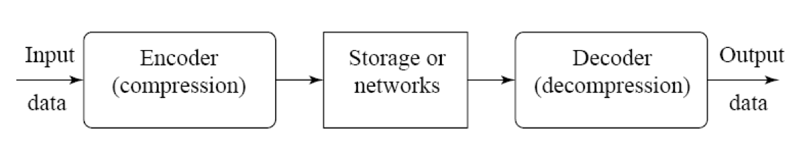
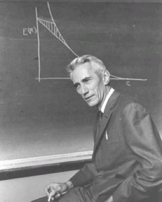
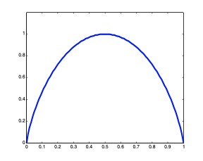
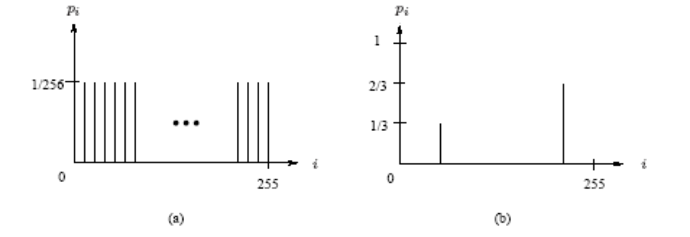
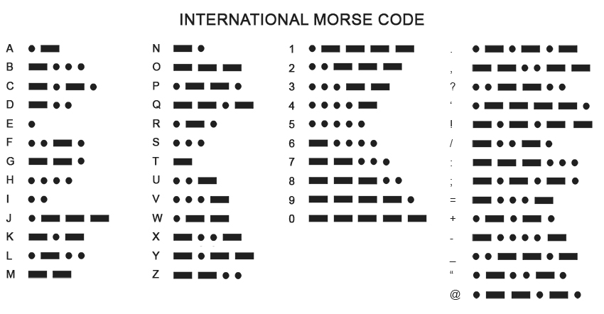
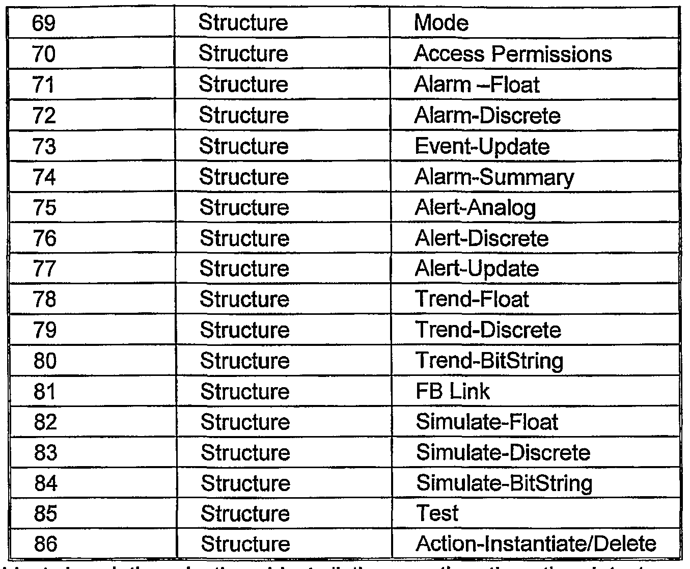

Intro to Multimedia Systems Seminar

Lossless Compression

material adapted from Fundamentals of Multimedia, 3rd ed. by Drs. Ze-Nian Li, Mark S. Drew, Jiangchuan Liu
and lecture slides by Dr. Jiangchuan Liu

compression: process of coding that reduces total number of bits needed to represent specific info

coding: substitute some symbols for other symbols

data compression scheme (on a high level):

output of encoder = code/codewords
communication
lossy/lossless

why compress?

1200 x 675
720p: 1280 x 720
1080p: 1920 x 1080

for 1 min of anime at 720p:
pixels per frame = 1280 * 720= 921,600 pixels
modern anime use 10 bit colour depth usually
bits per frame = 921,600 * 30=27,648,000 bits
Bytes per second=3,456,000 * 24=82,944,000 bytes
Bytes for one minute = 82,944,000 * 60 = 4,976,640,000 bytes
(4.977 GB)

$$
\text{compression ratio} = \frac{B_0}{B_1}
$$
higher = better

what if B1 = 0?

the doctor story
to save time, doc doesn't call -> b1 = 0?

why is compression possible?

information redundancy

how to measure "information"?

information theory

info -> measure of uncertainty/surprise
less probable = more info

covid case confirmed! (feb 2020)
covid case confirmed! (feb 2024)

I(A) = f(P(A))

claude shannon: self information
I(A) = $$log_b \frac{1}{P(A)}$$

our unit: 2 for bits

shannon defines entropy of an info source with alphabet S = {s1, s2, ..., sn} as
$$η = H(S) = \sum_{i=1}^{n} p_i \log_2 \frac{1}{p_i} = -\sum_{i=1}^{n} p_i \log_2 p_i$$
avg self info
avg min number of bits needed to losslessly represent 1 output of source
aka avg amt of info contained per symbol

avg number of bits to code each symbol ≥ η 

P(A) = x, P(B) = 1-x

uniform: log2 ( 256) = 8
2 vals: 0.92

physics?

. . . - - - 
EEE? A? V? 2? O? M? J?

prefix free:
- no codeword is prefix of another
- uniquely decodeable

shannon-fano coding

top down
sort symbols by frequency then recursively divide till theres only 1 symbol
L/R order doesn't matter (tree not unique)
balance: larger on left

avg codeword length: take avg of all pi * num of bits

huffman is pretty cool

shannon-fano constructs optimal tree only *sometimes*
bottom up
still unique prefix
always produces optimal
most frequent: shortest
least: longest
also not unique

limitations:
- needs prob distb
- min codeword len is 1 bit

extended/joint huffman
symbols grouped together
A B A B B A A B -> AB AB BA AB
new alphabet: {AB BA AA BB}
size increases exponentially!

LZW: Lempel-Ziv-Welch
patent expired
uses fixed length codewords to repr variable len strings
encoder + decoder both dynamically build same dict

arithmetic coding

partition into recursive intervals
each interval size is proportional to prob
once ur in an interval u never get out
final interval: any num ok

decoder works as the interval partition is unique

problems
- no output till end
- precision error/floating point roundoff error

scaling and incremental coding

as range shrinks, most significant bits become the same
ex: 0.7712 and 0.773504 = 0.110001*0*... and 0.110001*1*..
so output identical MSB and rescale

E1: [0, 0.5) -> output 0 and x 2 (left shift)
E2: [0.5, 1) -> output 1 and 2(x - 0.5)

interval doesnt matter, only final output